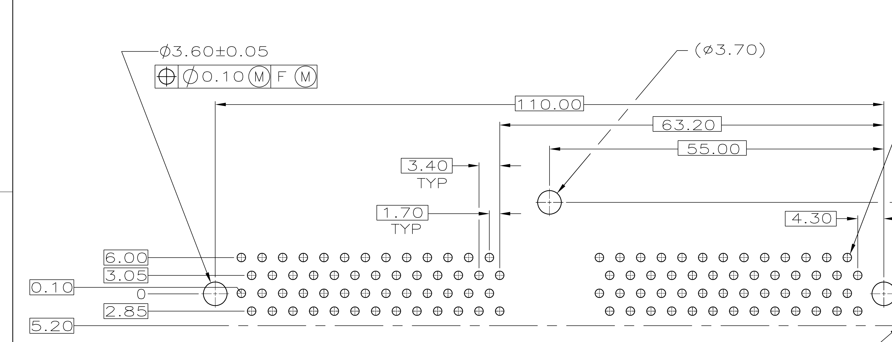

# Sourcing the EEC-V 104-pin connector

For a plug-and-play ECU the board needs the **PCB-mount header** — the male
half the PCM presents to the harness. Note this is the opposite half from what
is usually sold.

## The problem

The board-mount header is a **controlled Ford part**. Buying it new through
Ford Component Sales requires manufacturer approval, which is not realistic for
a one-off. What is widely sold on eBay and in forums as a "Ford 104 Pin EEC-V
PCM Connector Assembly" is the **harness-side** connector plus dress cover —
useful for building a jumper harness, not for mounting on a PCB.

## Options, roughly in order of practicality

> ### ✅ Checked and closed: the TE part number is obsolete
>
> The drawing is **TE 770750-1**, revised **2009** — which looked like a live part
> and a way around Ford Component Sales. **Digi-Key lists it obsolete.**
>
> **A revised drawing can outlive its product.** The 2009 revision says the
> document was maintained, not that the part is orderable. Worth remembering
> before the next controlled drawing raises hopes.
>
> **So salvage is the only route for a board-mount header**, which is what this
> section already concluded — now with the alternative eliminated rather than
> assumed away.
>
> **Practical consequence: take every one you can get.** If a donor PCM passes
> through, pull the connector whether or not it is needed that week. They do not
> become more available, and the labour to extract one does not get cheaper.

## Extracting the header — procedure, and one way that does not work

One-shot operation on a part that cannot be bought, so the notes are cheap
insurance.

### ⚠ Not with a heat gun — and the drawing says why

**Tried, and it melted the housing before any joint let go.**

TE 770750-1's title block gives the material: **HOUSING: PBT**. Polybutylene
terephthalate melts around **225 °C**. Eutectic leaded solder melts at
**183 °C**. **That is only ~40 °C of margin** — and a heat gun applied from the
connector side spends all of it in the wrong place:

- The **housing is the near side**. It heats first, directly.
- The **joints are on the far side**, soldered into a multilayer board whose
  ground planes pull heat away as fast as it arrives.

So the plastic reaches 225 °C while the joints are still short of 183 °C. **The
geometry guarantees the failure** — it is not a matter of turning it down.

> **Inspect the connector before relying on it.** Cosmetic scorching is
> survivable; a housing that has *distorted* may have moved pin positions, and
> the drawing's positional tolerance is **Ø0.10**. Check that the pins still sit
> in a true 4 × 26 grid and that the sleeve is not deformed.

### What does work: a vacuum desoldering gun

| | |
|---|---|
| **1. Strip the conformal coating** over the joints | it clogs the nozzle and blocks flow. Ford's is usually acrylic — IPA or acetone. Silicone needs mechanical removal |
| **2. ⭐ Add fresh leaded solder to every joint first** | the single biggest one, and counter-intuitive. Old joints flow badly; wicking 63/37 in lowers the melting point and gives the vacuum something that actually moves |
| **3. Flux generously** | |
| **4. Expect thermal mass** | automotive multilayer with heavy planes. More dwell than a hobby board, and find the setting on scrap first |
| **5. Posts and centre boss last** | the two Ø3.60 posts and the Ø3.70 centre are large masses and **may be mechanically retained, not just soldered** — do not mistake that for a cold joint |
| **6. Do not lever until all 104 are free** | one attached pin lifts a pad or **bends a pin**. On this part a bent pin is the expensive outcome; a lifted pad is on a board being scrapped anyway |

**One piece of luck: a 2001 PCM is pre-RoHS**, so the joints are leaded. Lead-free
would have been meaningfully worse — a higher melting point against the same
225 °C housing.

---

**1. Salvage a scrap EEC-V PCM.** Cut the header off a dead junkyard PCM and
transplant it. This is what most builders do, it is cheap, and the part is
guaranteed correct for the truck. Downsides: desoldering a 104-pin header from
a potted automotive board is tedious, and the pins may need cleaning up before
they will take a new board.

**2. Buy the harness-side connector and build a jumper.** Fit a generic
high-density header on the ECU board and make a short adapter loom to the OEM
connector. This gives up true plug-and-play but removes the sourcing problem
entirely, keeps the ECU board layout free, and makes the ECU usable on other
vehicles later. **Recommended if the goal is a working truck rather than an OEM
appearance.**

**3. rusEFI's footprint — verified, and the best starting point.** rusEFI has
a complete 104-pin EEC-V footprint and two boards using it, GPLv3, in
[rusefi/rusefi](https://github.com/rusefi/rusefi):

- `hardware/Breakout_104pin_EEC-V-Connector/` — breakout board
- `hardware/EEC-V-Blank-Board/` — blank board carrying just the connector
- footprint `rusefi_lib:eecv`, symbol `eecv_EEC-V` (104 pins)

Geometry extracted from `eecv.kicad_pcb`:

| Property | Value |
|---|---|
| Pads | 104 through-hole, round |
| Arrangement | **4 rows × 26** |
| Pitch within a row (X) | **3.4 mm** |
| Row-to-row spacing (Y) | **3.0 mm** |
| Row stagger | **1.7 mm** — alternate rows offset by half the pitch |
| Drill | **1.143 mm** (0.045″) |
| Pad diameter | **1.778 mm** (0.070″) |
| Pin field | 101.4 × 9.0 mm |

Numbering runs row by row — row 1 is pins 1–26, row 2 is 27–52, row 3 is
53–78, row 4 is 79–104 — and within each row the pin numbers **decrease** as X
increases, so pin 1 sits at one end and pin 26 at the other.

Note it is a **staggered** 4-row field, not a rectangular grid. Do not
approximate it with a generic 4×26 header; the 1.7 mm offset is what makes it
mate.

## ✅ CLOSED — the TE controlled drawing has the board layout, with tolerances

**[`ENG_CD_770750_C.pdf`](ENG_CD_770750_C.pdf)** — Tyco/TE drawing **770750-1**,
*"Sleeve Assembly, Wire Connector Female"* — carries a **RECOMMENDED P.C. BOARD
LAYOUT** panel. It was in the repository the whole time.



| | rusEFI extraction | **TE drawing 770750-1** |
|---|---|---|
| **Pin hole** | 1.143 mm drill | **Ø1.40 ±0.05**, 104 PLC ⚠ |
| Pin pitch in a row | 3.4 mm | **3.40 TYP** ✓ |
| Row stagger | 1.7 mm | **1.70 TYP** ✓ |
| **Mounting posts** | *not recorded* | **2 × Ø3.60 ±0.05** |
| **Post spacing** | — | **110.00** |
| **Centre hole** | *not recorded* | **Ø3.70** ref, **55.00** from each post |
| Board edge | — | **5.20** below the datum |
| Positional tolerance | — | **⊕ Ø0.10 Ⓜ | F | Ⓜ** on both hole types |

### ⚠ The drill disagrees by 0.26 mm — but a physical test says it is not fatal

> ## ✅ TESTED: a rusEFI PCB fits over the salvaged connector
>
> **Everything seats** — all 104 pins, both posts, the centre boss — **except the
> one post that mushroomed under the heat gun, which is ~1 mm oversize.**
>
> **That corrects two things this section said.**
>
> **1. "A hole the pin may not enter, 104 times" was overstated.** The pins enter
> a 1.143 mm hole. TE's Ø1.40 is a *recommended* hole and recommendations carry
> assembly margin; the pin itself is smaller than the recommendation implies.
> **Still use Ø1.40** — it is the manufacturer's number and the margin is free on
> our own board — but 1.143 is not a failure, it is a tighter fit.
>
> **2. "104 pads and nothing else" was wrong about the footprint, not about the
> extraction.** The rusEFI board clearly has the post holes, because the
> connector's posts go into it. **What was incomplete was the geometry table in
> this document**, which recorded only the signal pads. The footprint was never
> missing them.
>
> **A physical fit beats a document comparison**, and this is the second time
> today that re-checking against the part has corrected a conclusion drawn from
> paper.

**Use the TE drawing as the footprint authority** — it is the manufacturer's
controlled document for this exact part, toleranced, with a positional datum.
The rusEFI geometry agrees on pitch and stagger, and now agrees in practice on
everything else.

### The posts, and the one that needs sanding

The **two Ø3.60 holes at 110.00 centres** take the connector's posts. Together
with the **Ø3.70 centre hole** they are its mechanical retention into the PCB —
the other half of the story from the case's metal lip.

> **Sanding a mushroomed PBT post, ~1 mm oversize on diameter:**
>
> | | |
> |---|---|
> | **Rotate constantly** | a flat spot fails the hole as surely as oversize does. Wrap a strip of paper round it and work it like a shoe-shine |
> | **Go slow — friction is heat** | PBT smears rather than cuts once it warms, and heat is what caused this. A power tool will make it worse |
> | **0.5 mm of radius is not much material** | test-fit often and stop the moment it enters |
> | ⭐ **Gauge against the rusEFI PCB, not a printed part** | it has real holes at real tolerance. [`conn_gauge`](../../hardware/carrier-template/) is a fallback for when that board is not to hand |

> **Build the footprint from the drawing directly.** The row Y positions are
> dimensioned from the post centreline (**6.00 / 3.05 / 0 / 2.85**, board edge at
> **5.20**) and are worth reading off the PDF at full zoom rather than from this
> summary, because a scan is a poor place to resolve the second decimal.

## ~~⚠ The footprint above is 104 pads and nothing else~~ — resolved above

**The donor connector has posts through the PCB as well as pins**, and this
extraction records **no mounting posts, no alignment features, no keepout.**
Either rusEFI's footprint has them and the extraction missed them, or it does
not have them at all.

**And the case has a metal lip that seats into the connector.** So the OEM
retention is mechanical in two directions — posts into the board, lip from the
case — which is how a 104-way insertion force is taken without loading the
solder joints.

> **[CONFIRM] before layout**, from the donor board's underside:
>
> | | |
> |---|---|
> | **How many posts**, and their diameter | holes we do not currently have |
> | **Where they sit relative to the pin field** | ⭐ the datum. Pin field position is already `[MEASURE]`d; the posts are measured *from it* |
> | Whether they are plated, and whether the OEM tied them to anything | a plated post landing on a plane is a decision, not an accident |
> | **Where the case lip lands** relative to the connector body | it constrains the enclosure, not the PCB — but it sets how the two locate to each other |
>
> **Getting this wrong means the connector will not sit down on the board.**
> Cheap to check now, a respin to discover later.

**4. Copy what the MS3Pro PNP does.** DIYAutoTune built exactly this product
for exactly this truck. Their PNP unit mates to the OEM connector, so they
solved the sourcing problem. Whether they will say how is another matter, but
the physical part is identifiable from a unit or from photos.

---

## Pin numbering — resolved, with a warning

**Use flat 1–104.** Both the MegaSquirt sheet for this truck and the rusEFI
footprint number the connector 1–104 straight through, and rusEFI's 4 rows × 26
accounts for exactly 104 pins. The two agree, so that is the scheme for this
vehicle.

**The `EEC-V-Power-Pins.png` sheet does not fit this connector and should not be
used for pin assignments on this truck.** It uses connector-relative numbering
(A-13, A-20, B-17, C-17) implying three separate connectors, and its content
contradicts the truck data directly:

- It lists **A-24 through A-27 as all PWRGND**.
- On this truck, pin 25 is ground but **pin 26 is Ignition Coil 1** and pin 27
  is Ignition Coil 5.

Two grounds where four should be, with ignition outputs in their place. No
constant offset reconciles the schemes. That sheet is almost certainly a
different EEC-V variant — the three-connector style used on other applications
— rather than this truck's single 104-pin connector.

What remains valid from it is the *conceptual* content, which is what it was
used for: that the PCM sources VREF, that signal return is separate from power
ground, and that FEPS exists. The **pin numbers** in it do not apply here.

~~**[CONFIRM]** VREF and SIGRTN against the flat numbering instead~~ —
**CLOSED, both against Ford's own diagrams.** VREF is **circuit 351 BN/WH to
pin 90** ([`schematic-findings.md`](schematic-findings.md) §1); SIGRTN is
**circuit 359 GY/RD to pin 91**, spliced at S135/S138 (§2). The MegaSquirt
sheet agreed on both. **And the chart is not a different numbering of this
connector — it is a different, three-connector PCM** (§ the stop header in
[`oem-connectors.md`](oem-connectors.md#-eec-v-pcm--power-ground-and-reference-pins--not-this-trucks-pcm)).

---

# Sensor-side connectors — CKP and CMP

**Ordered: Motorcraft `3U2Z145411SMA`** — "Camshaft Crankshaft Position Sensor
Connector", supplied as a pigtail.

**One part number covering both sensors is itself a useful fact.** It means CKP
and CMP use the same 2-cavity connector, which confirms what
[`vr-conditioning.md`](vr-conditioning.md) records: **both are two-wire VR
sensors.**

## "Single-ended" CMP does not mean one wire

[`eec-v-pinout.md`](eec-v-pinout.md) shows pin 85 as a lone "CMP+" (DK GRN) with
no matching CMP−, which is what made CMP look single-ended. It is not — the
sensor still has two wires. The second one lands on the PCM's **shared sensor
ground** instead of a dedicated CMP− pin.

That is a compromise the factory made to save a PCM pin, and **there is no
reason to inherit it.**

| | Factory | **TritonECU** |
|---|---|---|
| CKP+ (DK BLU) | pin 21 | **VR1+** |
| CKP− (GRY) | pin 22 | **VR1−** |
| CMP signal (DK GRN) | pin 85 | **VR2+** |
| CMP return | tied to shared SGND | **VR2−** — its own leg |

**Route the CMP return wire to VR2−, not to board ground.** The MAX9926's
differential input then does its job on *both* channels, and the CMP channel
stops sharing an IR-drop path with every other sensor return. It costs nothing —
the wire is already in the harness, it just terminates somewhere better.

There is no conflict if that wire also reaches ground elsewhere: VR2− sits behind
5 kΩ into a high-impedance differential input.

## Quantity

**Order three**, not one:

| | |
|---|---|
| CKP, vehicle | 1 |
| CMP, vehicle | 1 |
| **Bench rig** | **1** — so the rig's sensor plugs in rather than being cut into |

The third is the one that is easy to forget and annoying to be without: with a
pigtail on the rig, the same VR board harness moves between bench and truck
unmodified, and nothing gets spliced twice.

## Identify the cavities before crimping

The pigtail arrives with short untagged tails. **Which cavity is which is not
guessable** — check continuity against the sensor, or against the vehicle
harness colours recorded in [`eec-v-pinout.md`](eec-v-pinout.md):

```
CKP+  DK BLU      CKP−  GRY       CMP  DK GRN
```

Polarity is worth getting right but is not fatal if swapped: the MAX9926 is
differential and Mode A2 triggers on the zero crossing, so an inversion moves
which edge the decoder should use rather than breaking detection. Easier to fix
in the harness than in firmware, though — so confirm it on the rig, where the
shaft position is known.

---

# Repinning the 104-pin connector

Terminals ordered, so cavities can be changed or added.

## There are four spare cavities already

[`eec-v-pinout.md`](eec-v-pinout.md) records these as **"Not used"** on this
application — they belong to the 4-sensor HO2S configuration a two-bank truck
does not have:

| Cavity | Factory function on other applications |
|---|---|
| **35** | RR HO2S signal |
| **61** | LR HO2S signal |
| **95** | RR HO2S heater |
| **96** | LR HO2S heater |

**⚠ Verify each is physically empty before counting on it.** That table was built
partly from a MegaSquirt pinout reference, and "not used on this application" in
a document is not the same as "no terminal in this connector". Trim levels
differ. Look in the cavity.

## First use: give CMP its own return

The change recommended above — **CMP return to VR2− instead of shared SGND** —
needs no new wire. The wire already runs from the sensor to the connector; it
just lands in a shared sensor-ground cavity.

**Pull that terminal and move it to one of the spares.** Same wire, same length,
different hole. That is the entire job, and it converts CMP from a compromised
single-ended channel into a proper differential pair.

## The crimp tool matters more than the terminals

This is the part that is easy to get wrong and expensive to diagnose.

**A generic crimper produces a joint that passes a tug test and fails months
later**, under vibration and thermal cycling. On a crank or cam sensor that
presents as an **intermittent no-start that comes and goes with temperature** —
the single worst fault class to chase, because it is absent whenever you are
looking for it.

Get the correct die for Ford micro terminals, and:

- **Match the wire gauge to the terminal's barrel.** Undersized wire in an
  oversized barrel crimps to a joint that is mechanically loose however good the
  tool is.
- **Get the terminal removal pick as well**, not just the terminals. Levering a
  terminal out with a screwdriver deforms the lock tang, and it will not retain
  afterwards — the terminal backs out under vibration, which looks exactly like
  a broken wire.

## Crimp, do not solder

Soldering a harness joint creates a stiffness discontinuity: the wire goes from
flexible to rigid at the edge of the solder wick, and that is where it
work-hardens and cracks. A properly crimped terminal has no such transition.

This is why automotive harnesses are crimped everywhere and soldered almost
nowhere, and a rig that will live on an engine is not the place to break with it.

## Record every repin

A modified harness that matches no factory diagram is a trap for whoever works
on it next, including the person who modified it.

**Log changes in [`eec-v-pinout.md`](eec-v-pinout.md)** — cavity moved from, moved
to, wire colour, and why. The wire colours are already in that table, which makes
it the natural place: a future reader can then diff what is in the truck against
what Ford shipped.

## Terminal part numbers

| Part | |
|---|---|
| **E7EB-14487-AA** | **female** — harness side |
| **E6DZ-14487-AA** | **male** — PCM/board side |
| `33088-0009` | **[confirm]** what this cross-references to — kit, assortment, or another vendor's number |

**The female is the one repinning needs.** The PCM presents a male header and the
harness carries the sockets, so every terminal pulled and moved in the truck's
connector is an E7EB.

**The male is more interesting than it looks.** It is the terminal for the
*mating* side — which is the unsolved problem at the top of this document. If the
board-side 104-pin connector ends up being built rather than bought, E6DZ is what
populates it.

## ⚠ The wedge comes out first

"Wedgelock" is a **secondary lock**: a separate wedge that seats over the
terminals once they are in, and blocks the primary lock tangs from flexing.

**Nothing extracts while the wedge is seated.** Forcing it damages the tangs, the
cavity, or both — and a damaged cavity does not reliably retain a terminal
afterwards, which is an intermittent that only appears under vibration.

On a 1999 part, **expect the wedge to be brittle.** Twenty-five years of underhood
heat cycling makes the nylon far less forgiving than it was. Work it out
evenly rather than levering one corner, and warm it gently if it resists.

## Validate the crimper before touching the truck

The way to check a crimper you are not certain about, without a microsection:

**Crimp a scrap terminal onto the gauge you intend to use, and pull it.** A sound
crimp on 20 AWG holds on the order of 15–20 lbf. If the wire slides out of the
barrel with hand force, the die is wrong or the barrel is oversized for the wire
— and no amount of care in the harness fixes that.

Do this once, on the bench, before the first real terminal. It costs one
terminal and settles the question that would otherwise surface as a fault six
months later.

## Check the plating matches

Ford used **gold-plated terminals on some low-level signal circuits** and tin
elsewhere. Mixing the two in one mating pair sets up galvanic dissimilarity, and
under vibration that becomes **fretting corrosion** — an intermittent open, not
merely a resistance rise.

That matters most exactly where this project is sensitive: **a VR sensor at
cranking is producing a few hundred millivolts**, and an intermittent contact
there is a no-start with no stored code.

Look at what is already in the cavity before crimping its replacement. If the
factory terminal is gold and the new one is tin, source the matching plating
rather than accepting the mix.

---

# Could the board-side connector be printed?

Worth asking, since the male terminals are now in hand and the only supply of the
real thing is salvaged PCMs of unknown condition. Short answer: **harder than it
looks, and the failure modes are the bad kind.** But the sourcing problem has an
easier solution that is being missed.

## Why printing the housing is hard

### The material that is thermally right is dimensionally the worst

| Filament | Shrinkage | Over a ~100 mm body | Service temp |
|---|---|---|---|
| PLA | ~0.3 % | 0.3 mm | **~60 °C — out** |
| PETG | ~0.4 % | 0.4 mm | ~80 °C |
| ABS | 0.5–0.8 % | 0.5–0.8 mm | ~100 °C |
| **Nylon** (what Ford uses) | **1–2 %** | **1–2 mm** | ~180 °C ✓ |

Terminal-to-cavity clearance is on the order of **±0.1 mm**. Every option
overshoots it across the length of the part, and the one with the right
temperature rating overshoots by an order of magnitude — while also being
hygroscopic, warp-prone and the hardest filament to print well.

Scale compensation can claw back the systematic part. It cannot fix
**repeatability**, and FDM does not hold ±0.1 mm across 100 mm reliably.

### Retention ledges land on layer lines

The primary lock tang catches a small ledge inside the cavity. On an FDM part
that ledge is a layer boundary — inconsistent, and weak in exactly the direction
the tang loads it.

**A terminal that backs out under vibration is an intermittent**, which is the
fault class this project can least afford on a crank sensor.

### 104 terminals is a structural load

At roughly 1–2 N of insertion force each, mating is **100–200 N** through a
layered part, plus whatever the latch carries in separation. Printed parts split
along layers under exactly that kind of load.

## The reframe: you do not need a working PCM

**You need intact plastic and straight pins. The electronics are irrelevant.**

A PCM that is water-damaged, has burnt output drivers, or was pulled as a
core is **perfectly good as a connector donor** — and those are the cheap ones
nobody wants. "Not always in good shape" describes the circuitry, which does not
matter here.

Buy on condition of the **connector shell and pin field**, not the unit. That
widens supply enormously and drops the price.

## Where printing genuinely helps: a soldering fixture

Not the connector — a **jig that holds a salvaged pin field in register while it
is soldered to the PCB.**

That plays to FDM's strengths instead of its weaknesses: it only has to be
accurate *locally*, it carries no service load, it never sees engine-bay
temperature, and if it is 0.3 mm out over its length it simply gets reprinted.

## Before committing either way: print a six-cavity coupon

If the printed housing is still tempting, **do not start at 104 cavities.**
Print a short strip at the real pitch and try mating it with the corresponding
corner of the harness connector.

One small print answers the only question that matters — whether the tolerance
stack is achievable at all — before any effort goes into the full part.

## The option worth naming: do not use the factory connector

Terminating the harness into **AMPSEAL, Deutsch DT/DTM or Molex MX150** solves
sourcing permanently: new parts, sealed, proper tooling, sensible circuit counts.
The v1 build list is nowhere near 104 circuits — coils, injectors, the sensor
set, power and comms land closer to 50–60.

**What it costs is reversibility, and that is worth more than it sounds.**
Keeping the factory connector means the original PCM plugs back in and the truck
drives — while the prototype ECU is on the bench for rework. On a vehicle that
has to keep running, that fallback is the strongest argument for solving the
connector problem rather than cutting past it.

---

# Resolved: donor connector from a Ranger EEC-V

**Bought a damaged Ranger EEC-V as a connector donor.** The 104-pin shell was
used across the EEC-V generation, so a Ranger unit is expected to carry the same
connector as the F-150 one.

**The pinout being different does not matter.** What is being reused is the shell
and the pin field; the application's circuit assignment lives in the harness and
in [`eec-v-pinout.md`](eec-v-pinout.md), not in the plastic.

## ⚠ Check the polarising key before anything else

**Ford varies the keying between applications specifically so a PCM from one
vehicle cannot be plugged into another.** Same shell, different key.

**Offer the donor connector up to the F-150 harness connector before spending any
effort on it.** If the keys differ it will not mate, and that is worth knowing on
day one rather than after the connector has been desoldered and a PCB footprint
built around it.

If they do differ, the keys can usually be removed — but understand what that
gives up: the feature exists to stop the wrong ECU being fitted, and removing it
makes that mistake possible for whoever works on the truck later. Note it on the
unit if you do.

## Do not cut the pins off

The donor's pins are **solder tails**, made to go through a PCB. That is exactly
what this project needs, and it is **not** what the E6DZ terminals are — those
are crimp barrels for a wire-terminated connector.

The two do not combine. **Keep the donor's pins; they are the whole point of the
donor.**

The E6DZ/E7EB terminals remain useful for their own job: repinning the truck's
harness-side connector, including the CMP-return move above.

## Getting it off the donor board

| | |
|---|---|
| **Desolder in place** | 104 pins. A desoldering gun makes this about an hour; hot air and braid will take considerably longer and risks lifting the shell's retention posts |
| **Cut the donor PCB around it** | Faster and lower risk to the connector. Leaves a stub of the original board attached, which can then be desoldered pin-by-pin off a small piece, or in a hurry wired to directly |

**The connector is the part being preserved, not the donor board** — so bias every
decision toward protecting the shell and pins, and treat the PCB as scrap.

## Then: measure the pattern and build the footprint

The pin pattern has to become a PCB footprint. Measure it from the donor
directly rather than trusting a published drawing — row spacing, pitch, and the
positions of any mechanical retention posts.

Worth comparing against the **rusEFI 104-pin PCB template** noted earlier in this
project: if it matches the donor, that is a footprint already proven in
manufacture rather than one drawn from measurements.

## What this closes

The sourcing problem at the top of this document. The remaining risk is a single
mechanical check — **the key** — and it costs nothing to do now.

---

# ★ The controlled drawing — TE 770750-1

`ENG_CD_770750_C.pdf` is Tyco/TE **customer drawing C-770750, rev C (26 AUG
2009)**: *"SLEEVE ASSEMBLY, WIRE CONNECTOR FEMALE"*, part number **770750-1**.

This is the **board-side connector**, and having the controlled drawing changes
two things at once.

## It may be buyable new

A TE part number on a drawing revised in 2009 is not a discontinued Ford service
item — it is a catalogue part. **Check TE, DigiKey and Mouser for 770750-1
before committing to the salvage path.**

If it is orderable, the whole sourcing problem at the top of this document
disappears, and the Ranger donor becomes a useful spare and fit-check rather
than the only supply.

## It contains the complete PCB footprint

The drawing carries a **RECOMMENDED P.C. BOARD LAYOUT** with full dimensions and
tolerances. **Draw the footprint from this, not from measuring the donor.**

| | |
|---|---|
| Positions | **104**, as **4 rows × 26** — matching the "TERMINAL, 26 PLC" callouts |
| Pin holes | **Ø1.40 ±0.05**, 104 places |
| Mounting holes | **Ø3.60 ±0.05**, **110.00 mm** apart, positional tol Ø0.10 Ⓜ F Ⓜ |
| Centre hole | Ø3.70 |
| Pitch callouts | **3.40 TYP** and **1.70 TYP** |
| Row offsets | 6.00 / 3.05 / 0 / 2.85 / 5.20 from the datum |
| Housing | **PBT** |
| Weight | 85 g |

**Transcribe those from the PDF at full zoom, not from this table** — the values
above were read off a 150 dpi render and are here to show what the drawing
contains, not to be used as the source. The tolerances matter: Ø0.10 Ⓜ
positional on the mounting holes is tight enough that a footprint drawn by eye
will not seat.

Worth checking against the **rusEFI 104-pin template** as a cross-reference. Two
independent sources agreeing is worth more than either alone.

## It confirms the terminals are solder tails

The cross-section shows four rows of right-angle terminals running down into the
board, with a retainer. That settles the earlier point: **the donor's pins are
PCB solder tails and must not be cut**, and they are a different thing entirely
from the E6DZ crimp barrels.

## Two specs worth chasing

The title block references:

```
Product Spec       108-1715
Application Spec   114-6054
```

**114-6054 is the one to find.** TE application specifications carry the terminal
part numbers, wire gauge ranges, plating options, **crimp tooling and extraction
tool part numbers** — which is every open question from the sections above,
answered by the manufacturer rather than inferred.

That includes the gold-versus-tin plating question: the socket contact
cross-referenced for this family, **TE 776235-1**, is listed as *gold* — so the
factory terminals in the truck's connector are very likely gold, and tin
replacements would be the mismatch to avoid.

## 770750-1 is EOL — what that does and does not change

**Does not change:** the drawing. Geometry, tolerances and the recommended PCB
layout are properties of the part, not its availability. **The footprint is still
drawn from C-770750**, and the donor connector matches it.

**Does change:** salvage is now the supply, not a fallback. The Ranger donor was
the right purchase.

### Buy spare donors now

Dead EEC-V PCMs are currently **cheap and plentiful, and will never be more so**.
That curve only goes one way, and this project may want a connector again years
from now — for a second board, a replacement, or a bench harness.

**Two or three donors is cheap insurance** against a problem that gets steadily
harder to solve. Buy on shell and pin condition as before; the electronics remain
irrelevant.

### Get a desoldering gun before the first extraction

The other half of the answer. A 104-pin through-hole part is **not a one-shot
operation** with the right tool — a desoldering gun makes it routine, maybe an
hour, repeatable across board revisions.

With braid and an iron it is a slow, hot, marginal job that risks the shell's
retention posts, and that is where an irreplaceable part gets damaged.

**Tool plus spares turns connector scarcity from an architectural constraint into
a consumable one.**

### Why *not* to move the connector onto its own interface board

The tempting answer to a scarce, hard-to-move part is to isolate it — solder it
once to a small board and link that to the main board, the way
[`carrier-board.md`](../carrier-board.md) isolates the MCU and
[`adc-daughterboard.md`](../adc-daughterboard.md) isolates the analog front end.

**That pattern is right for those and wrong for this.**

Both of those isolate a handful of signals. This would put **104 additional
contact pairs in series with every circuit in the vehicle** — injectors, coils,
crank sensor, power — inside something that vibrates and heat-cycles for years.
Every one of them is a new intermittent that did not have to exist, and
intermittents in this harness are the fault class the whole project is least able
to diagnose.

The scarce part is better solved by **stockpiling donors and owning the right
tool** than by adding 104 connections to the reliability budget.

### Still worth ten minutes

Check whether TE lists a **successor or cross-reference** for 770750-1, and
whether the family had a **second source** — Ford rarely single-sourced a
connector used across an entire ECU generation.

---

# RETRACTED: the CMP repin is not needed

**Design principle, decided:** keep the factory harness unmodified. Everything is
referenced the way we want it **inside the ECU**, not by moving wires.

That is the right call, and it makes the earlier repinning recommendation
unnecessary.

## Both VR channels already arrive at the connector

| | Cavity | Wire | |
|---|---|---|---|
| **CKP+** | **21** | DK BLU | dedicated pair — nothing to decide |
| **CKP−** | **22** | GRY | |
| **CMP signal** | **85** | DK GRN | |
| **CMP return** | **91** — SGND / Sensor Ground | GRY/RED | shared, but **present at the connector** |

**That is the whole answer.** The CMP return was never missing — it lands in the
shared sensor-ground cavity instead of a dedicated CMP− pin. The wire is at the
connector either way.

So:

```
VR1+ ← pin 21      VR2+ ← pin 85
VR1− ← pin 22      VR2− ← pin 91
```

**No terminal moves.** Pin 91 feeds both the board's sensor-ground star *and*
VR2− — they do not conflict, because VR2− is a high-impedance input behind 5 kΩ.

## What is given up, and why it does not matter

A dedicated return would also reject IR drop between the CMP sensor and wherever
its return joins the sensor-ground network. Sharing means it does not.

**That drop is sub-millivolt.** The sensors on that network draw a few
milliamps through tens of milliohms. A VR sensor at cranking produces **hundreds
of millivolts**. The error is three orders of magnitude below the signal, and the
differential input still rejects the large common-mode offset between the engine
and the ECU — which is the part that actually matters.

## The principle worth keeping

**The board defines what every cavity connects to.** Almost any "this should be
referenced differently" question is therefore a **PCB routing decision, not a
harness modification** — and the PCB is the thing that can be revised, while the
harness is the thing that has to still be diagnosable in ten years with a Ford
wiring diagram.

### Extend it: preserve the factory ground splits

Ford runs **two separate sensor grounds** into this connector:

| | Cavity | Wire |
|---|---|---|
| MAF Return / Sensor Ground | **36** | TAN/LT BLU |
| SGND / Sensor Ground | **91** | GRY/RED |

**They were separated deliberately** — the MAF draws far more current than the
small three-wire sensors, and sharing a return would put its drop into every
other reading.

**Keep them as separate nets on the board**, joined only at the star point. The
temptation is to merge them because both say "sensor ground"; doing so undoes a
factory decision for no gain.

## The terminals are still worth having

Repinning tooling stays useful for **repair, not modification** — a corroded
terminal, a damaged lock tang, a wire that needs replacing. Restoring a circuit
to factory condition is entirely consistent with leaving the harness otherwise
untouched.
