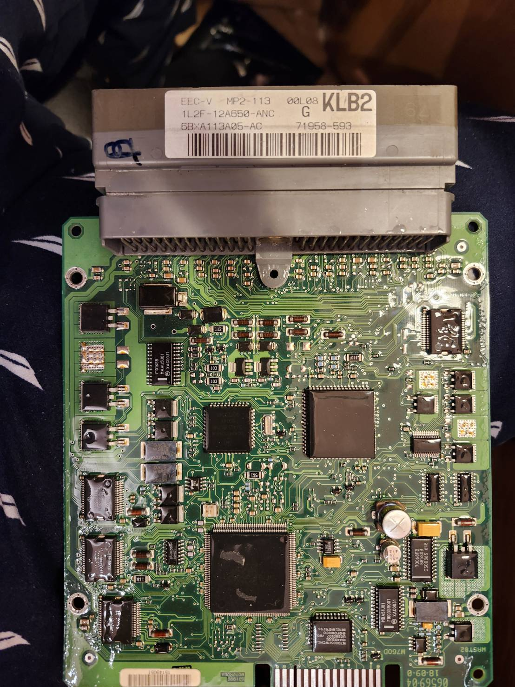
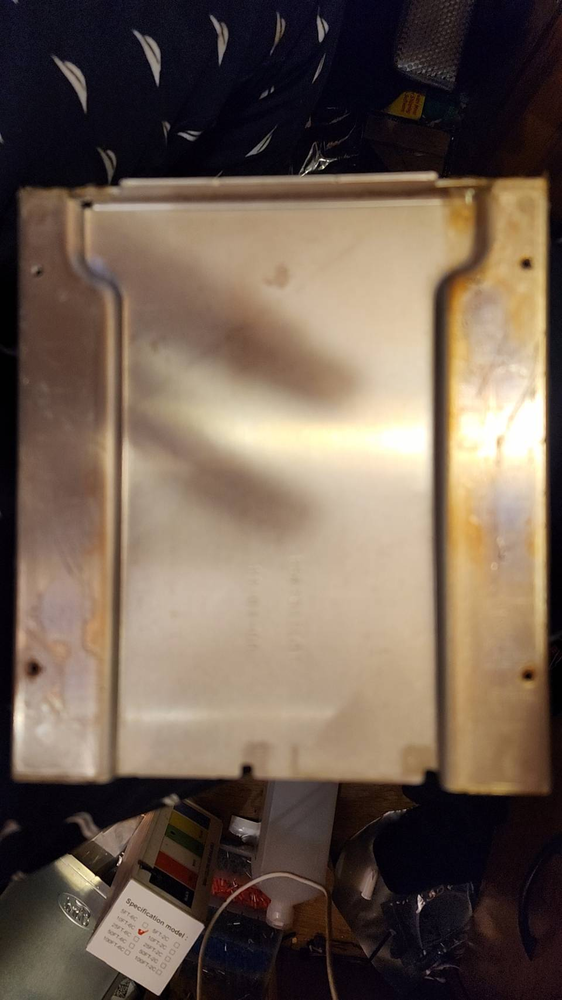

# Donor PCM — the source of the 104-pin connector



The EEC-V board-mount header cannot be bought — see
[`../1999-Ford-F150-4wd-5.42v/connector-sourcing.md`](../1999-Ford-F150-4wd-5.42v/connector-sourcing.md).
This board is where ours comes from, and it is also the **dimensional datum**
for the carrier outline.

## What the label says

```
EEC-V   MP2-113   00L08   KLB2
1L2F-12A650-ANC     G
6B*A113A05-AC       71958-593
```

| | |
|---|---|
| **`1L2F-12A650-ANC`** | Ford part number. `12A650` is the PCM family; **`1L2F`** dates it to **2001**, Explorer/Mountaineer |
| `KLB2` | calibration / strategy code |
| `MP2-113` | hardware variant |

> ✅ **Corrected: this is a 2001, not a 1998.** The file was first named
> `1998-…` from memory; the part number is the authority. Ford's prefix scheme
> reads **`1L2F`** as **2001 model year**, with `L2` the Explorer/Mountaineer
> platform. A © 1998 date on the board is the *design* date — EEC-V hardware ran
> for years — not the assembly.
>
> It does not change the connector either way. It was worth fixing because the
> filename is what someone will trust later.

## Does an Explorer header fit an F-150 harness?

**It should** — the 104-pin EEC-V header is common across EEC-V applications,
which is the whole reason salvage works. **But confirm the pin field against the
rusEFI geometry before designing to it:**

| | |
|---|---|
| Arrangement | 4 rows × 26 |
| Pitch within a row | 3.4 mm |
| Row-to-row | 3.0 mm |
| **Stagger** | **1.7 mm** — alternate rows offset half a pitch |
| Drill / pad | 1.143 / 1.778 mm |
| Pin field | 101.4 × 9.0 mm |

## ✅ 158 × 174 is the bare PCB

The photo shows no housing, and the board outline's aspect ratio measures
**0.901** against the stated **158/174 = 0.908** — within 1 %. So the envelope
in [`../carrier-envelope.md`](../carrier-envelope.md) is the **board**, not a
case.

> ### ⚠ Then what was the 31 mm measured across?
>
> If it is **board plus connector**, the **connector is the tallest thing on the
> assembly** — not the Nucleo's RJ45 at 27.7 mm — and the height analysis was
> solving the wrong constraint. A standard EEC-V header stands roughly 25–30 mm
> off the board, which is consistent with 31 mm over a 1.6 mm PCB.
>
> **This does not change the 35 mm target or the 46.5 mm ceiling**, both of which
> clear either reading. It changes *which component sets the floor*.

## How to capture the datum properly

**Do not measure this off a photograph.** Perspective and lens distortion make
hole patterns untrustworthy, and the hole pattern is the entire point.

> **Put the bare board on a flatbed scanner at 600 dpi**, glass-down, connector
> included. A scan is orthographic and dimensionally accurate: import it into
> CAD, scale it with a known reference (the 3.4 mm pin pitch across all 26
> positions is an excellent one — 85 mm over 25 gaps averages out error), and
> trace directly.

What has to come out of it:

| | |
|---|---|
| **PCB outline** | including any notches or cutouts |
| **Mounting holes** | centres and diameters. The photo shows holes at the corners plus at least one centre boss below the connector |
| **Pin field position relative to the outline** | ⭐ **the datum everything else places from** |
| Connector body height above the board | settles the question above |
| Board thickness | probably 1.6 mm, worth confirming |


---

# The case bottom — and a better idea than copying it



Cast/stamped metal, with **raised side rails carrying the mounting holes** and a
large **recessed centre pan** — the "divot". The board does not sit on a flat
floor.

## ⭐ Reuse the case bottom, don't reproduce it

[`../enclosure.md`](../enclosure.md) already says *"no wireless, so no antenna
window… the housing **may be metal**, which helps both shielding and the thermal
path."* The donor supplies exactly that, and it solves four problems at once:

| | |
|---|---|
| **Vehicle mounting** | The bolt pattern is *already correct* — nothing to measure, match or get wrong |
| **Connector face** | The opening, its position and the gasket land come with it. `enclosure.md`: *"that face is the firewall penetration… the donor shell dictates the opening"* |
| **Shielding** | A metal floor under eight IGBTs and thirteen switching low-side drivers, free |
| **Thermal** | Metal, in contact with vehicle structure |

**And it explains the envelope constraints exactly as they were given:** X–Y fixed
because the *bottom* is fixed; height adjustable because only the **lid** has to
change. A **printed lid on the donor bottom** gets the 35 mm target without
giving up any of the above.

> **[CONFIRM] the lid joint** — flange width, screw positions and whether the OEM
> sealed it with a gasket or RTV. That is what a printed lid has to mate to.

## What the divot actually decides

Which of these it is changes the board design, and one measurement separates
them:

| If the pan is… | Then it means | Consequence |
|---|---|---|
| **Recessed away from the board** | clearance for through-hole lead tips and bottom-side parts | tells you the **under-board budget** — how long leads may protrude, whether bottom-side placement is allowed |
| **Raised toward the board** | a **thermal boss** the OEM pressed against a hot area | a **free heatsink**, and it says where Ford put the heat. Worth aligning our own hot parts to |

> **[MEASURE] the pan depth relative to the rail faces, and its sign.** Straight
> edge across the rails, depth gauge to the pan. Positive or negative is the
> whole question.

## What to take off the case

| | Why |
|---|---|
| **Bolt pattern** — centres and hole diameter | the real interface to the vehicle. **More important than the 158 × 174 outline**, which can flex if the bolt pattern is held |
| Rail face height above the pan | sets the board plane |
| Pan depth and sign | § above |
| Internal clear height, board plane to lid | confirms whether the 31 mm was board-plus-connector |
| Gasket land and lid screw pattern | what a printed lid mates to |

## One caution

The photo shows **corrosion and staining** on the flanges. Before committing to
reuse: clean it, check the **gasket land is flat and uncorroded**, and check the
mounting-hole bosses are not cracked. A firewall penetration that does not seal
is worse than a printed box that does.
